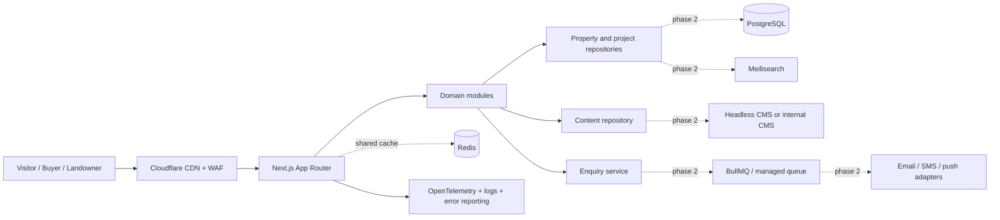
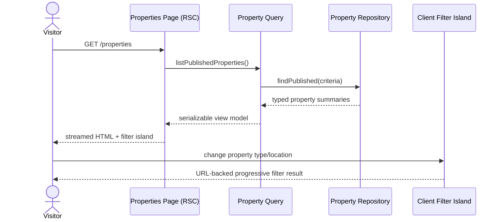

# Abdullah Properties Platform Architecture

Status: Accepted for the public-platform foundation  
Architecture style: Modular monolith with explicit extraction seams  
Primary market assumption: Joypurhat, Bangladesh  
Delivery assumption: public property discovery and qualified lead generation come before marketplace transactions

## 1. Executive Summary

The first production slice is a fast, accessible public platform for Abdullah Properties: brand storytelling, property discovery, project proof, service education, editorial content, and high-intent enquiries. It is intentionally not an e-commerce marketplace. Cart, vendor wallet, coupon, refund, and multi-provider payment infrastructure are deferred until a confirmed business workflow requires them.

The recommended starting point is a modular monolith built with Next.js 16 App Router, React 19, TypeScript, Tailwind CSS, and owned shadcn/Radix primitives. Server Components render content-heavy routes; small Client Components own filters, navigation, and motion. Domain repositories begin as typed in-memory adapters and can be replaced by PostgreSQL/Prisma implementations without changing page composition.

## 2. Architecture Overview

- Public web: server-first pages, route metadata, static generation, progressive enhancement.
- Application modules: properties, projects, services, content, enquiries, identity, and shared brand UI.
- Ports: repository and notification interfaces isolate storage and vendors.
- Adapters: static content now; PostgreSQL, Meilisearch, R2, email, and Redis later.
- Operations: structured logs, traces, error reporting, analytics, and audit trails added at the boundary where persistent workflows begin.

Why this approach: it minimizes operational cost and distributed-systems failure modes while preserving clean ownership boundaries. Service extraction is a response to measured load, deployment cadence, or team ownership—not a starting ritual.

## 3. High-Level System Design



## 4. Low-Level Design

Each feature owns its domain types, repository contract, server query functions, UI composition, and tests. Cross-feature imports flow through public module entry points. Client state remains at leaf components.



## 5. Database Engineering

No production database is introduced in the first static release. The Phase 2 relational model should include `properties`, `property_media`, `property_features`, `projects`, `services`, `locations`, `enquiries`, `enquiry_events`, `content_entries`, `content_revisions`, `users`, `roles`, `permissions`, and `audit_events`.

- Normalize transactional data to third normal form; denormalize read models only after profiling.
- Use UUID/ULID identifiers, immutable public slugs, `created_at`, `updated_at`, and explicit publication status.
- Recommended indexes: publication status + published date; location + property type; price range; project status; enquiry owner + status + created date.
- Add partial indexes for published/non-deleted rows and unresolved enquiries.
- Use optimistic concurrency on editable content and listings through a version column.
- Prefer archived status to silent deletion; reserve soft delete for recovery requirements.
- Use PgBouncer or a provider-native pool for serverless connections.
- Require tested migrations, point-in-time recovery, encrypted backups, and quarterly restore drills before launch with persistent data.

## 6. API Engineering

- Server Components call domain query functions directly for first-party page reads.
- Server Actions are appropriate for same-origin enquiry and CMS mutations after authentication and CSRF controls are defined.
- REST route handlers under `/api/v1` are reserved for public integrations, webhooks, mobile clients, and search autocomplete.
- tRPC is deferred: it adds little value while one App Router client consumes the server. Adopt it only if shared TypeScript clients materially reduce contract duplication.
- GraphQL is not justified without heterogeneous clients that need flexible graph traversal.

Every external boundary requires Zod validation, stable error codes, request IDs, rate limits, authorization, idempotency where writes may retry, and an OpenAPI contract for public REST endpoints.

## 7. Folder Structure

```text
app/                         # routes, layouts, metadata, route states
components/
  brand/                     # logo, section headings, visual motifs
  layout/                    # header, mobile navigation, footer
  ui/                        # owned shadcn/Radix primitives
features/
  properties/                # domain, queries, repository, components
  projects/
  services/
  content/
  enquiries/
lib/                         # shared utilities and infrastructure ports
public/brand/                # optimized brand assets
public/properties/           # optimized listing/project imagery
docs/                        # ADRs and operating documentation
tests/                       # route/render and architecture tests
```

## 8. Security Engineering

- Treat all browser input, CMS content, webhook payloads, and uploads as untrusted.
- Validate on the server with Zod; encode output through React; sanitize any allowed rich text.
- Use secure, HTTP-only, same-site cookies for sessions; rotate tokens and enforce short-lived sensitive actions.
- Re-check authorization inside Server Actions and route handlers; middleware/proxy is never the only gate.
- The worker applies a baseline CSP, `frame-ancestors`, `nosniff`, referrer policy, permissions policy, and cross-origin opener policy. Verify them on the deployed response; add HSTS only after the final HTTPS custom domain is approved.
- Rate-limit enquiry, search, auth, password reset, and upload endpoints by layered IP/account/device signals.
- Scan uploads, restrict MIME and extension, randomize object keys, and serve through a separate media domain.
- Store secrets in platform secret management, never source or client bundles.
- Model admin and customer isolation with RBAC; introduce ABAC only for branch, portfolio, or regional ownership rules.
- Payments must use provider-hosted/tokenized flows to minimize PCI scope.

## 9. Performance Engineering

- Statically render stable marketing and detail routes; use tag-based revalidation when a CMS arrives.
- Keep the page shell in Server Components and isolate interactive filters/navigation.
- Use responsive image sizes, explicit dimensions, modern formats, and priority only for the true LCP image.
- Load below-fold media lazily and avoid autoplay video on constrained networks.
- Animate transforms and opacity only; honor `prefers-reduced-motion`.
- Measure TTFB, LCP, CLS, and INP by route and device class before adding optimization infrastructure.
- Establish budgets: no unexpected horizontal overflow, stable hero geometry, and a deliberately small initial client bundle.

## 10. Redis Strategy

Redis is deferred until there is shared mutable server state or expensive repeated work. Valid adoption cases are distributed rate limits, session lookup, short-lived search suggestions, idempotency keys, job coordination, and hot aggregate caches. Each key must have an owner, TTL, versioned namespace, size budget, and failure policy. Redis Pub/Sub is not durable and must not replace a queue for business-critical events.

## 11. Caching Strategy

- CDN: immutable fingerprinted assets and safe public page caching.
- Next.js: static generation/ISR for public content; explicit tags per property, project, and content entry.
- Search: short TTL for anonymous repeated queries only after measuring cache benefit.
- Redis: cache-aside with jittered TTL and bounded negative caching when Phase 2 requires it.
- Invalidation: write transaction -> outbox event -> search/cache invalidation -> observable completion.
- Never cache personalized or authorization-sensitive responses in a shared scope.

## 12. State Management Strategy

- Server state: Server Components first; TanStack Query only for frequently refreshed client-owned views.
- URL state: property filters, pagination, sorting, and shareable discovery context.
- Form state: native forms for simple cases; React Hook Form + Zod for complex multi-field flows.
- UI state: local component state; Zustand only when unrelated client islands genuinely share ephemeral state.
- Persistent state: PostgreSQL for business records; object storage for media; browser storage only for non-sensitive preferences.
- Offline state: not required for the public first release; reassess for a field-agent application.

## 13. CMS Design

Phase 2 CMS scope: homepage sections, reusable landing-page blocks, banners, announcements, FAQs, projects, properties, services, area guides, articles, SEO fields, navigation, and media. Content requires draft, review, scheduled publish, version history, preview, rollback, role-based permissions, and audit history. A structured-block model is preferred over unrestricted HTML.

## 14. Vendor System

Assumption: Abdullah Properties is currently a single operator, not an open multi-vendor marketplace. A vendor subsystem is therefore deferred. If verified partners later publish inventory, create a separate partner bounded context with verification, listing ownership, moderation, commission policy, statements, support, and contractual audit—not e-commerce vendor tables repurposed for real estate.

## 15. Admin System

Planned modules: operational overview, property/project inventory, enquiries and assignments, content workflow, media, users, roles, audit events, notifications, SEO, analytics, integrations, feature flags, and system health. Admin routes require separate authorization, stricter session policy, MFA, immutable audit logging, and no shared public-page cache.

## 16. Customer System

The first release is anonymous discovery and enquiry. Later customer capabilities may include saved properties, comparison, viewing requests, document checklist, enquiry history, notifications, and profile/address management. Cart, checkout, wallet, rewards, returns, and order tracking are not appropriate until the business confirms a transaction model.

## 17. DevOps

Use reproducible installs, pinned lockfiles, environment validation, preview environments, immutable builds, least-privilege service identities, managed secrets, CDN/WAF protection, and automated backups. Containerization is useful for local dependencies and portable workers; it is not required for a platform-native frontend deployment.

## 18. CI/CD

Pull requests must run type checking, linting, unit tests, route/render tests, build, dependency/security review, and targeted browser smoke tests. Production deployment requires an immutable commit, approval policy, migration compatibility check, health check, and documented rollback. Database changes follow expand/migrate/contract to support zero-downtime rollout.

## 19. Testing

- Unit: pure domain mappers, filter semantics, validation schemas.
- Component: keyboard behavior, focus management, form errors, empty/loading/success states.
- Contract: repository and external provider adapters.
- Integration: enquiry persistence, idempotency, publication workflow, search synchronization.
- End-to-end: primary navigation, property discovery, detail view, and enquiry conversion.
- Non-functional: accessibility, performance budgets, security headers, rate limits, and restore drills.

## 20. Deployment

The public site targets the Sites/Cloudflare-compatible vinext build already configured in this repository. Persistent services are added behind environment-specific adapters. Deployment is blue/green or immutable-version based, with smoke tests against the candidate before traffic promotion and a one-command rollback to the last healthy version.

## 21. Monitoring

Adopt OpenTelemetry traces at server/action/adapter boundaries, structured Pino logs with request IDs, Sentry-style exception capture, uptime checks, and product analytics with privacy controls. Alert on user-impacting SLOs: error rate, latency, failed enquiries, queue age, search failures, and publication failures—not raw infrastructure noise alone.

## 22. Cost Optimization

Prefer static rendering, CDN delivery, image resizing, and scale-to-zero compute. Add PostgreSQL, search, Redis, and queues only with measured demand. Set retention limits for logs, traces, media derivatives, and analytics. Monitor cost per successful enquiry and cost per published property rather than cost per service in isolation.

## 23. Scaling Strategy

1. Scale the stateless web tier horizontally behind CDN/WAF.
2. Add PostgreSQL with pooled connections and indexed queries.
3. Introduce Meilisearch when database search no longer meets relevance/latency goals.
4. Add Redis for proven shared-cache/rate-limit/session needs.
5. Move slow notifications/media work to a durable queue.
6. Extract a service only when independent scaling, reliability, compliance, or team ownership outweighs distributed-system cost.

## 24. Technical Debt Prevention

Maintain architecture tests for module boundaries, ADRs for irreversible decisions, typed provider ports, dependency review, API version policy, database migration ownership, deprecation windows, accessibility gates, and quarterly removal of dead flags/adapters. Every temporary compromise needs an owner and expiry condition.

## 25. Future Roadmap

- Phase 1: public brand system, properties, projects, services, insights, contact, SEO, analytics baseline.
- Phase 2: PostgreSQL catalog, enquiry workflow, CMS, media library, admin RBAC/MFA, transactional notifications.
- Phase 3: customer accounts, saved searches, viewing scheduling, Meilisearch, Redis rate limiting/cache, background jobs.
- Phase 4: verified partner portal only if the business adopts a partner marketplace model.
- Phase 5: transaction/payment abstraction only for a confirmed booking, reservation, rent, or installment workflow.

## 26. Engineering Best Practices

Default to server-first rendering, explicit domain language, small pure functions, schema validation, composition, typed errors, accessibility, observable boundaries, deterministic tests, and minimal dependencies. Optimize after measurement. Prefer one well-owned module over an early network of services.

## 27. Risks and Tradeoffs

- Static sample content can validate UX but cannot prove operational workflows; production data contracts still require stakeholder discovery.
- A modular monolith shares a deployable unit, but materially reduces early operational complexity. Module boundary tests mitigate coupling.
- Custom motion can harm INP and accessibility; motion is progressive, transform-based, and removable through user preference.
- AI-generated brand imagery is useful for presentation but must be replaced or rights-verified for production listings.
- A full marketplace architecture before the business model is confirmed would create the largest avoidable cost and security surface.

## Initial Route Contract

| Route | User goal | Rendering | Primary action |
|---|---|---|---|
| `/` | Understand the brand and best opportunities | Static | Explore properties |
| `/properties` | Browse and filter available inventory | Static + client URL filters | View property |
| `/properties/[slug]` | Assess one property/project | Static params | Request details |
| `/projects` | Review delivery capability and portfolio | Static | Discuss a project |
| `/services` | Understand end-to-end services | Static | Book consultation |
| `/about` | Verify trust, approach, and local commitment | Static | Meet the team / contact |
| `/insights` | Learn from area and property guidance | Static | Read an article |
| `/contact` | Start a qualified conversation | Static + progressive form | Send enquiry |
