# Abdullah Properties Cinematic Public Experience Roadmap

Status: core cinematic release implemented and verified; deployment approval pending  
Scope: public routes and shared public chrome only; the Office OS and Content Studio keep restrained application motion  
Design basis: Abdullah Properties brand system, verified business content, the accepted reference synthesis, and the audited local Webflow motion studies

## Current checkpoint — 2026-07-14

- [x] Office OS, CMS, public-route separation, and private/noindex boundaries verified.
- [x] Halo Lab and local Webflow reference patterns audited without copying assets or claims.
- [x] Cinematic server-rendered hero, responsive type hierarchy, visible-first line motion, and bounded 7% media parallax implemented.
- [x] One five-chapter sticky desktop decision story implemented with native hash navigation, one-shot chapter reveals, mobile/reduced-motion flattening, and hidden-document observer cleanup.
- [x] Transparent AP mark + name ghost marquee implemented with two seamless groups, mobile scaling, offscreen/hidden-tab pause, explicit Pause/Resume control, and static no-JavaScript/reduced-motion states.
- [x] Dead legacy hero CSS removed to restore bundle reserve.
- [x] Production build, 42 artifact/domain tests, 62 browser tests, automated WCAG checks, 320 px overflow checks, reduced-motion checks, and zero-vulnerability production audit passed.
- [ ] Complete a human visual inspection after the local URL is available to the in-app browser security boundary.
- [ ] Publish the immutable release after explicit approval, then run deployment smoke checks and field-metric observation.

## One-line goal

Turn the public website into a calm, evidence-led property story that earns attention, explains how Abdullah Properties works, and moves a serious visitor toward one qualified enquiry without copying another studio or distracting from the decision.

## Definition of the experience

The experience should feel cinematic because its information has rhythm, hierarchy, and consequence—not because every element moves. A visitor must understand, in order:

1. what Abdullah Properties does;
2. whether the company serves their situation;
3. how the working process reduces uncertainty;
4. what proof or records support the promise;
5. what the visitor should prepare next;
6. how to start a useful conversation.

The primary conversion is a prepared enquiry. Browsing properties, reading an area guide, and using the property planner are supporting actions, not competing calls to action.

## User journey and story spine

```mermaid
flowchart LR
  A["Arrival: place and proposition"] --> B["Orientation: choose buyer, landowner, or project path"]
  B --> C["Trust: verified scope and operating principles"]
  C --> D["Understanding: one guided process narrative"]
  D --> E["Proof: projects, properties, documents, and local context"]
  E --> F["Preparation: checklist or property planner"]
  F --> G["Conversion: one qualified enquiry"]
  G --> H["Continuity: clear response expectation and client-care path"]
```



### Journey states

| Moment | Visitor question | Content response | Primary action |
|---|---|---|---|
| Arrival | “Am I in the right place?” | Joypurhat context, plain-language proposition, one strong image, current verification label | Explore the right path |
| Orientation | “Do you handle my situation?” | Buyer, landowner, development, and after-sales routes with distinct outcomes | Choose a path |
| Trust | “Why should I believe this?” | Operating principles, evidence boundaries, process ownership, verified records | See how Abdullah works |
| Understanding | “What happens after I contact you?” | One pinned desktop process story with stages, deliverables, decision gates, and next steps | Advance through the process |
| Proof | “Can I inspect the work?” | Published projects, available-property records, quality gates, area knowledge, and document guidance | Open relevant evidence |
| Preparation | “What do I need before speaking?” | Local-only planner, checklist, and transparent limits | Prepare my enquiry |
| Conversion | “What is the smallest useful next step?” | Concise enquiry route with contact alternatives and response expectation | Start an enquiry |
| Continuity | “What happens later?” | Client-care, handover, records, and issue-routing information | Review client care |

## Layout hierarchy

The homepage is the canonical story. Supporting routes deepen one chapter rather than repeating the whole homepage.

1. **Public header** — transparent-background brand mark, five or fewer primary destinations, one enquiry action, accessible Explore layer.
2. **Hero / arrival** — local context eyebrow, short proposition, one dominant supporting visual, single primary CTA, restrained secondary text link.
3. **Kinetic orientation rail** — brief, non-interactive brand/service vocabulary; never a replacement for navigation.
4. **Role-path chooser** — buyer, landowner, project client, and client-care paths with outcomes instead of feature lists.
5. **Trust ledger** — what is verified, what requires direct confirmation, and how Abdullah Properties handles records and decisions.
6. **The one pinned process narrative** — the only scroll-pinned storytelling sequence on the page.
7. **Selected proof** — projects/properties/quality evidence using editorial cards and real publication status.
8. **Local context** — area guides, daily-life questions, location knowledge, and due-diligence links.
9. **Preparation tools** — property planner, resource checklists, and document guidance.
10. **Editorial insight** — useful, dated articles or FAQs; no filler carousel.
11. **Conversion panel** — one concise enquiry action and explicit alternatives for phone/location.
12. **Legal footer** — practical navigation, verified contact information, legal/disclaimer copy, then the decorative ghost brand marquee.

### Page-level pacing

- Alternate dense information with visual breathing room; do not stack three “feature grid” sections.
- Use one dominant visual idea per viewport.
- Keep section introductions to one claim and one supporting paragraph.
- Place a meaningful interaction at most every two to three sections.
- Repeat the main enquiry action only at decision points: hero, after process/proof, and final CTA.
- Do not insert a new section unless it answers a distinct visitor question or reduces a conversion risk.

## Responsive typography system

Typeface limit: Anybody for display and Work Sans for body/interface. The modular relationship is approximately 1.25, adjusted optically at display sizes. Fluid values use `clamp()` so mobile text remains composed instead of merely shrinking desktop typography.

| Token | Fluid size | Line height | Tracking | Use |
|---|---|---|---|---|
| `display-hero` | `clamp(3rem, 8.4vw, 8.25rem)` | `0.88–0.94` | `-0.055em` | Hero only; maximum 10–12 words across two to four lines |
| `display-section` | `clamp(2.5rem, 6.2vw, 6.5rem)` | `0.92–0.98` | `-0.045em` | Major story chapters |
| `heading-xl` | `clamp(2rem, 4vw, 4.25rem)` | `1.00–1.06` | `-0.035em` | Primary section heading |
| `heading-lg` | `clamp(1.625rem, 2.7vw, 3rem)` | `1.05–1.12` | `-0.025em` | Card groups and route heroes |
| `heading-md` | `clamp(1.25rem, 1.8vw, 1.75rem)` | `1.15–1.22` | `-0.015em` | Cards and process stages |
| `body-lg` | `clamp(1.0625rem, 1.2vw, 1.25rem)` | `1.55–1.65` | `-0.01em` | Section introductions; cap at 58 characters |
| `body` | `clamp(1rem, 0.35vw + 0.925rem, 1.125rem)` | `1.55–1.7` | `0` | General reading copy; cap at 68 characters |
| `body-sm` | `clamp(0.875rem, 0.2vw + 0.825rem, 1rem)` | `1.45–1.6` | `0` | Metadata and secondary information |
| `label` | `clamp(0.75rem, 0.15vw + 0.72rem, 0.875rem)` | `1.2–1.35` | `0.06em–0.1em` | Eyebrows, status, compact controls; uppercase only when short |

Typography constraints:

- Never place the hero display token inside cards or the footer navigation.
- Do not use condensed display text for paragraphs, form labels, or controls.
- Headlines wrap deliberately with CSS-balanced wrapping where supported and readable fallback everywhere else.
- Set `max-width` by reading measure, not arbitrary grid width.
- At 320 px, no display line may be clipped and no word may force horizontal scrolling.
- Bengali-ready content must fall back to a tested Unicode font with comparable x-height; do not force Anybody where glyphs are absent.
- Browser zoom at 200% must preserve content order and actions without horizontal two-dimensional scrolling.

## Motion grammar

Motion communicates hierarchy, location, progression, or continuity. It never delays access to content.

### Motion tokens

| Motion | Duration | Easing | Allowed properties | Purpose |
|---|---:|---|---|---|
| Micro feedback | `150–240ms` | ease-out in, ease-in out | opacity, transform, color | Button, icon, focus/pressed feedback |
| Content entrance | `400–650ms` | cubic-bezier approximating a soft ease-out | opacity, transform | One-shot section or card entrance |
| Chapter transition | `550–800ms` | emphasized ease-out | opacity, transform, clip-path only after profiling | Shift process stage and supporting media |
| Parallax | scroll-linked | linear mapping, clamped | transform only | Add depth to one or two editorial images |
| Footer marquee | `28–48s` per loop, responsive | linear | transform only | Quiet brand continuity after all useful content |

### Approved choreography

- **Exactly one pinned process narrative.** On large screens, the process media/heading may remain sticky while four to five semantic stages progress in normal document flow. On mobile and at high zoom, it becomes a non-pinned vertical sequence.
- **Masked word reveals only for chapter headings.** The full accessible heading stays available to assistive technology. Words animate once, preserve markup, and remain visible with JavaScript disabled.
- **Parallax is limited to 4–8% of the media frame travel.** Apply it to at most two major images, never text, forms, maps, or controls.
- **Ghost footer marquee.** Two explicit identical groups contain the transparent AP mark plus the one-line “Abdullah Properties” name. It loops seamlessly, pauses when offscreen or the document is hidden, and becomes static for reduced motion.
- **Card and image feedback.** Use small scale/translate changes with overflow-safe media and a visible text response; touch users receive the same information without hover.
- **Page entry.** Server-rendered content is visible immediately. Optional leaf-level reveals begin only after hydration and may not create layout shift.

### Rejected choreography

- No global scroll hijacking, smooth-scroll interception, or Lenis dependency.
- No preloader or artificial loading percentage.
- No hero text scramble, random glyph substitution, or unreadable decode effect.
- No literal 3D cube or WebGL effect without a specific product/content need.
- No second pinned section and no long mobile pin such as a `260%` scroll range.
- No animation of layout properties such as `top`, `left`, `width`, or `height` during continuous motion.
- No `textContent`-based splitting that destroys links, emphasis, language spans, or accessible names.
- No initial CSS state that hides meaningful content until JavaScript runs.

## Interaction principles

1. One primary action per screen or section.
2. All navigation and chapter controls are native links or buttons with visible focus, labels, and current state.
3. Scroll may advance the story, but never becomes the only way to inspect a process stage; explicit controls or semantic reading order provide an equivalent path.
4. Hover enhances an already understandable card. It cannot reveal the only title, status, price, or action.
5. Touch targets are at least 44 by 44 CSS pixels where practical and never overlap.
6. Focus is never trapped outside a modal/navigation layer and always returns to the invoker.
7. Pointer, keyboard, touch, reduced-motion, and no-JavaScript users receive the same information and actions.
8. Animation pauses when its content is not relevant, including offscreen marquee motion and hidden documents.
9. The experience never invents inventory, ratings, project completion, team identity, approvals, timelines, prices, or investment returns.
10. Analytics events describe intent (`process_stage_viewed`, `planner_completed`, `enquiry_started`) and must not collect unnecessary personal content.

## Module and data boundaries

Public content remains server-first. Client code owns only animation state, transient controls, and local planner interaction.

```text
app/(public)/
  page.tsx                         # server-composed canonical story
  layout.tsx                       # public chrome only

components/
  experience/
    process-story/                 # single progressive narrative island
    footer-ghost-marquee/          # decorative brand continuity
    editorial-media/               # bounded parallax/reveal wrappers
  motion/
    word-reveal/                   # explicit string/word model; chapter headings only
    reveal/                        # existing one-shot primitive

features/public-experience/
  queries.ts                       # server-only published view-model assembly
  presentation.ts                  # pure content-to-view-model transforms
  types.ts                         # serializable, readonly public contracts

public/brand/                      # transparent AP marks and optimized brand assets
tests/                             # render, domain, accessibility, motion, and browser tests
```

Boundary rules:

- Route files query typed public view models; they do not import database adapters into Client Components.
- Story sections accept serializable props and do not fetch from the browser on initial render.
- Motion primitives accept explicit text/content and presentation options; they do not own business claims.
- The CMS or curated repository owns publish state, verification labels, dates, slugs, and SEO fields.
- Draft, archived, unverified, or access-controlled content cannot enter a public view model.
- Server failures render an honest boundary or curated fallback. They are not converted into fabricated content.
- The footer marquee is decorative (`aria-hidden`) because equivalent brand identity already exists in semantic footer content.
- Office and Studio routes do not import cinematic public components.

## State design

| State | Required behavior |
|---|---|
| Loading | Stable server-rendered geometry or route-level skeleton only when data is genuinely deferred; no full-screen preloader and no fake percentage |
| Empty | Explain that no verified item matches, retain the path back, and offer one relevant alternative such as area guidance or enquiry |
| Error | Preserve public shell and contact route, state that content could not be loaded, log a request ID server-side, and provide a retry where safe |
| Success | Confirm the completed action and its next step without confetti or forced redirect; planner remains local until the visitor explicitly submits |
| No JavaScript | All core copy, links, process stages, proof cards, footer/legal information, and enquiry route remain visible and usable; decorative animation is absent |
| Reduced motion | No pinned choreography, parallax, masked movement, autoplay, or infinite marquee; present final states and a static brand lockup |
| Slow network | LCP image is prioritized and sized; below-fold media is lazy; content hierarchy remains readable before optional client chunks |
| Missing media | Maintain aspect ratio and show a branded neutral fallback with useful alternative text where the image is informative |
| Unverified content | Clearly label verification status or omit the claim; never style illustrative imagery as a completed property record |
| Offline after load | Keep already-rendered content readable; form failure retains user input and gives an explicit recovery path |

## Accessibility contract

- Meet WCAG 2.2 AA for contrast, keyboard access, focus visibility, names, roles, error messaging, and target sizing where applicable.
- Maintain one `h1` per page and a logical heading hierarchy independent of visual size.
- Use landmarks and skip navigation; moving decorative regions are excluded from the accessibility tree.
- The pinned process remains an ordered semantic list. The active visual is supplemental, not the only carrier of information.
- Word reveals expose one complete accessible heading and hide duplicated animated words from assistive technology.
- Marquee content is decorative, cannot receive focus, and stops under `prefers-reduced-motion: reduce`.
- Avoid rapid flashes, large unexpected motion, scroll traps, auto-advancing controls, and pointer-only behavior.
- Test at 320 px, 200% zoom, Windows High Contrast/forced colors where feasible, keyboard-only, and reduced motion.
- Form errors connect to fields, use an error summary for multi-field failures, preserve values, and move focus only when it helps recovery.

## SEO and content contract

- Every indexable route has a unique title, description, canonical URL, one useful `h1`, and meaningful server-rendered content.
- Open Graph and social previews use branded, route-relevant images with safe text zones; they do not present illustrative imagery as verified inventory.
- Add only schema types supported by the page’s real content. Do not manufacture review, rating, offer, price, availability, organization, or employee facts.
- Keep Organization/LocalBusiness identity consistent with verified name, address, contact, logo, and social profiles.
- Property/project routes expose stable slugs, status labels, publication/update dates, breadcrumb structure, and descriptive image alternative text.
- Supporting pages deepen a topic and link back into the story; they do not duplicate the homepage copy for keyword density.
- Sitemap, robots, canonical rules, and internal navigation reflect the same published route set. Office and Studio remain noindex/private.
- Decorative marquee text is not a hidden keyword mechanism and is excluded from assistive/SEO duplication.
- Performance, usefulness, local evidence, and crawlable structure are the ranking strategy. No implementation can guarantee first position in Google.

## Performance budgets

Repository bundle gates remain authoritative. The cinematic phase must fit inside the existing compressed route-split budgets:

| Budget | Hard gate | Cinematic-phase allocation |
|---|---:|---:|
| Largest JavaScript asset, gzip | `<= 65 KiB` | No new standalone motion runtime |
| Total route-split JavaScript, gzip | `<= 260 KiB` | Prefer `<= 12 KiB` additional compressed JS and preserve release reserve |
| Largest CSS asset, gzip | `<= 25 KiB` | Put cinematic styles in a scoped module instead of expanding one global asset |
| Total route-split CSS, gzip | `<= 36 KiB` | Prefer `<= 4 KiB` additional compressed CSS |

Runtime targets are launch objectives measured by route and device class, not unverified claims:

- LCP: `<= 2.5 s` at the 75th percentile.
- INP: `<= 200 ms` at the 75th percentile.
- CLS: `<= 0.1` at the 75th percentile.
- TTFB: `<= 800 ms` at the 75th percentile for cacheable public routes.
- No unexpected horizontal overflow at 320 px.
- No layout shift from font loading, reveal initialization, pinned-stage media, or footer marquee.
- Continuous animations use compositor-friendly transforms and stop when hidden.
- Use Server Components by default, CSS before JavaScript, existing Framer Motion only where stateful choreography earns it, and no GSAP/Lenis/WebGL dependency for this phase.
- Give the true LCP image explicit dimensions/sizes and priority; lazy-load below-fold media and avoid autoplay video.

## Large auditable implementation TODO

The checklist is ordered. An increment is complete only when its code, focused tests, and review notes are complete. If a check fails twice for the same reason, change approach instead of repeating the patch.

### Increment 0 — Protect the known-good baseline

- [ ] Record the current branch, working-tree state, and existing user changes; do not overwrite unrelated work.
- [ ] Run typecheck, lint, artifact/domain tests, production build, and the existing Playwright suite.
- [ ] Record compressed JavaScript/CSS baseline from the performance-budget test.
- [ ] Capture desktop and mobile screenshots of the current homepage and footer.
- [ ] Confirm public, Office, and Studio route groups still use separate shells.
- [ ] Confirm Office and Studio remain private/noindex and visually unaffected by public motion.
- [ ] Write the rollback boundary for each subsequent increment.

### Increment 1 — Lock the narrative and evidence map

- [ ] Inventory every current homepage section and name the visitor question it answers.
- [ ] Remove or merge only duplicated sections; preserve unique user-approved content.
- [ ] Map each public claim to a verified source, curated record, or explicit illustrative label.
- [ ] Define the buyer, landowner, project-client, and client-care route outcomes.
- [ ] Select one primary CTA for each story chapter.
- [ ] Approve the final homepage order defined in this roadmap.
- [ ] Define the four or five process stages, each with deliverable, responsibility, evidence, decision gate, and next step.
- [ ] Identify the one hero/LCP image and at most two parallax media candidates.
- [ ] Draft concise alt text and captions based on function, not visual keyword stuffing.
- [ ] Validate that no copied Halo Lab/Webflow text, asset, layout, or claim enters the product.

### Increment 2 — Establish design and motion tokens

- [ ] Add the fluid type tokens and reading-measure tokens without changing Office/Studio typography.
- [ ] Define motion durations/easings as shared public-experience tokens.
- [ ] Add scoped cinematic CSS so the global stylesheet stays within budget.
- [ ] Verify font weights actually exist and remove synthetic/unused variants.
- [ ] Implement a reusable reduced-motion decision at the leaf component boundary.
- [ ] Ensure server HTML never starts with meaningful content hidden.
- [ ] Add tests for the type-token contract, reduced-motion styles, and no horizontal overflow.
- [ ] Review 320, 375, 768, 1024, 1440, and wide-screen composition before adding choreography.

### Increment 3 — Refine arrival and orientation

- [ ] Recompose the hero into context, proposition, supporting statement, dominant visual, and one primary CTA.
- [ ] Cap hero copy length and tune manual/balanced wrapping at mobile and desktop widths.
- [ ] Keep the transparent AP mark readable against every header state.
- [ ] Add one optional low-amplitude hero media treatment using transform/opacity only.
- [ ] Make the kinetic orientation rail inert, pauseable when applicable, and reduced-motion safe.
- [ ] Rewrite role-path cards around outcomes and next decisions rather than generic service features.
- [ ] Confirm the hero remains complete and attractive with JavaScript disabled.
- [ ] Add render and browser assertions for `h1`, primary CTA, image geometry, keyboard order, and mobile overflow.

### Increment 4 — Build the one process story

- [ ] Create a typed, serializable process-stage view model.
- [ ] Render all stages as an ordered semantic list in server HTML.
- [ ] Implement exactly one sticky/pinned desktop narrative with a bounded scroll range.
- [ ] Provide explicit button controls or equivalent semantic navigation for direct stage access.
- [ ] Synchronize active heading, stage evidence, progress, and supporting media without changing URL history on scroll.
- [ ] Use masked word reveals only on the process chapter headings.
- [ ] Keep one complete accessible heading while animated duplicate words remain `aria-hidden`.
- [ ] Limit supporting-media parallax to 4–8% and at most two media items across the page.
- [ ] Flatten the process into a normal vertical sequence on mobile, 200% zoom, and reduced motion.
- [ ] Avoid fixed heights tied to a single viewport; content expansion and translated text must not overlap.
- [ ] Stop observers/listeners on unmount and when the document is hidden.
- [ ] Test keyboard stage selection, scroll progression, direct reading order, reduced motion, no-JS output, and mobile flattening.

### Increment 5 — Strengthen proof and local relevance

- [ ] Recompose selected proof into outcome, current status, location, evidence, and relevant next action.
- [ ] Clearly distinguish property availability, project work, illustrative brand imagery, and editorial content.
- [ ] Add one restrained card-stack treatment only if it improves comparison; do not create another pinned scroll sequence.
- [ ] Keep all essential card content visible without hover.
- [ ] Connect quality gates, documents, and area guides to the appropriate process stage.
- [ ] Add useful “what to verify” guidance without presenting legal advice or guaranteed approval.
- [ ] Preserve stable image geometry and lazy loading for every below-fold visual.
- [ ] Test zero-item/empty proof, missing image, long title, long location, and unverified-status states.

### Increment 6 — Improve preparation and conversion

- [ ] Position the planner and resource checklists after proof, where they answer the visitor’s next decision.
- [ ] Keep planner state local until the visitor explicitly chooses to submit.
- [ ] Validate and sanitize all submitted values again at the server boundary.
- [ ] Preserve form values after recoverable errors and expose an error summary.
- [ ] Add honest loading, success, duplicate-submit, rate-limit, offline, and server-error states.
- [ ] State what happens after enquiry and provide phone/location alternatives.
- [ ] Emit privacy-conscious analytics for planner completion and enquiry start/success/failure.
- [ ] Test keyboard-only completion, invalid input, network failure, repeated submission, and successful recovery.

### Increment 7 — Build the ghost footer marquee

- [ ] Use the transparent AP mark asset, not a raster logo with a visible background box.
- [ ] Compose one lockup item as AP mark plus one-line “Abdullah Properties”.
- [ ] Render two explicit identical groups for a seamless loop; avoid one-time measured widths.
- [ ] Mark the moving region decorative and keep a semantic static brand identity elsewhere in the footer.
- [ ] Scale mark, wordmark, gap, and track speed with responsive `clamp()` values, including 320 px phones.
- [ ] Use transform-only CSS motion and prevent the track from widening the document viewport.
- [ ] Pause when offscreen, when the document is hidden, and optionally on intentional pointer interaction.
- [ ] Replace movement with one static lockup under reduced motion.
- [ ] Verify the loop seam after fonts load, viewport resize, browser zoom, and orientation change.
- [ ] Add component/render tests for duplicate groups, accessible exclusion, and transparent asset usage.
- [ ] Add browser tests for reduced motion, mobile scale, overflow, visibility pause, and footer/legal readability.

### Increment 8 — Complete route-level storytelling

- [ ] Give `/solutions` a role-based decision narrative rather than a duplicate services grid.
- [ ] Give `/joint-venture` an evidence/responsibility/decision-gate sequence.
- [ ] Give `/quality` inspection gates and record expectations without invented certifications.
- [ ] Give `/client-care` handover, issue-routing, and continuity states.
- [ ] Give `/resources` task-oriented checklists with clear ownership and last-reviewed dates.
- [ ] Keep `/property-planner` focused on preparation and explicit submission consent.
- [ ] Cross-link each supporting route to one previous and one next story chapter.
- [ ] Use route-level code splitting and avoid mounting homepage choreography on supporting pages.
- [ ] Add unique metadata, canonical, breadcrumb, sitemap, and server-render tests for each route.

### Increment 9 — Accessibility, resilience, and content QA

- [ ] Run automated WCAG checks on homepage, process story, footer, planner, and representative detail routes.
- [ ] Complete manual keyboard and screen-reader smoke tests for navigation, process controls, planner, and enquiry.
- [ ] Verify focus order and return behavior in the Explore layer.
- [ ] Verify reduced-motion output across every animated primitive.
- [ ] Disable JavaScript and confirm the complete story and actions remain accessible.
- [ ] Test 200% zoom, forced colors where feasible, 320 px width, landscape phone, tablet, and wide desktop.
- [ ] Verify every motion region stops when hidden or unmounted and creates no console warnings.
- [ ] Review all headings, labels, dates, statuses, links, alt text, legal statements, and contact facts.
- [ ] Confirm decorative text is not duplicated into the accessibility tree.

### Increment 10 — SEO, social preview, and structured-data QA

- [ ] Verify unique page titles/descriptions and one `h1` per indexable route.
- [ ] Verify canonical URLs, robots directives, sitemap coverage, and noindex boundaries.
- [ ] Create branded default and route-specific OG previews with safe crops and factual labels.
- [ ] Verify favicon, icon, manifest, logo transparency, and search-result identity assets.
- [ ] Validate structured data against the exact visible content and remove unsupported fields.
- [ ] Verify stable slugs, breadcrumbs, internal links, last-updated data, and redirect behavior.
- [ ] Check representative previews with social/debug tooling where available.
- [ ] Confirm no promise of a top Google ranking appears in public content or release claims.

### Increment 11 — Performance and security gate

- [ ] Run the compressed asset budget test and compare it with Increment 0.
- [ ] Keep largest/total JS and CSS within the hard gates in this roadmap.
- [ ] Profile hydration, long tasks, observer count, animation frame work, and memory after repeated navigation.
- [ ] Confirm only the true LCP image is eager/priority and all media has stable dimensions.
- [ ] Run Lighthouse or equivalent lab checks on mobile and desktop as diagnostic evidence.
- [ ] Collect field metrics after release before claiming Core Web Vitals targets.
- [ ] Run production dependency audit, security-header tests, input-validation tests, and sensitive-route noindex tests.
- [ ] Verify analytics do not receive form body, phone number, email, document data, or other unnecessary personal content.
- [ ] Remove dead experiment code, unused motion variants, duplicate assets, and debug logs.

### Increment 12 — Full verification and release decision

- [ ] Run typecheck, lint, unit/domain/artifact tests, full Playwright, performance budgets, and production build from a clean install state.
- [ ] Start the production-like local server with Windows-safe commands.
- [ ] Inspect homepage, process narrative, footer marquee, planner, and key routes in the real browser.
- [ ] Compare desktop/mobile screenshots with Increment 0 for regressions and with this roadmap for intent.
- [ ] Verify there are no console errors, failed resources, hydration warnings, broken links, or unintended horizontal scroll.
- [ ] Re-test public navigation and an anonymous Office-route boundary.
- [ ] Record known limitations and the reason each is acceptable or block release.
- [ ] Obtain release/publish approval if required by the active hosting workflow.
- [ ] Publish an immutable build, run deployment smoke checks, and retain a tested rollback target.
- [ ] Monitor errors, enquiry completion, LCP/INP/CLS, and abandonment through the initial observation window.

## Test and verification plan

| Layer | Coverage | Release evidence |
|---|---|---|
| Pure unit | stage selection, view-model mapping, text-word model, motion preference, planner validation | Deterministic tests with no DOM timing |
| Render/artifact | server-visible story, headings, links, metadata, canonical, duplicate marquee groups, noindex boundaries | Generated HTML assertions |
| Component | process buttons, focus, reduced motion, form states, visibility pause | Testing Library/component runner where configured |
| Browser E2E | desktop pin, mobile flattening, keyboard path, no overflow, marquee seam/pause, planner recovery | Playwright on Chromium at minimum |
| Accessibility | automated axe plus manual keyboard, zoom, reduced motion, accessible-name checks | Zero serious/critical findings; documented manual results |
| Performance | compressed assets, LCP media, long tasks, layout shifts, route splitting | Budget test plus production-like browser trace |
| SEO | metadata, canonical, sitemap, robots, structured data, OG assets | Route matrix and validator output |
| Security/resilience | headers, private-route boundary, server validation, rate/error states, dependency audit | CI output and focused boundary tests |
| Visual | 320/375/768/1024/1440 widths, dark/light media contrast, footer, long content | Reviewed screenshots with regressions resolved |

Verification order for every increment:

1. focused type/unit/render test;
2. typecheck and lint on changed scope;
3. production build when a route or dependency boundary changes;
4. browser check of the changed flow;
5. diff review for accessibility, performance, and unintended route coupling.

## Architecture and experience tradeoffs

### One pinned story instead of continuous scroll theatre

One bounded process narrative gives the experience a memorable center without turning the whole page into a scroll-controlled presentation. It reduces mobile fragility, accessibility risk, observer/listener cost, and content-maintenance coupling. The tradeoff is less spectacle; the benefit is a clearer process and stronger completion rate.

### CSS and existing Framer Motion instead of GSAP/Lenis

CSS handles the marquee and simple transforms; the existing motion dependency handles stateful leaf interactions. This avoids another runtime and global scroll ownership. The tradeoff is giving up advanced timeline tooling that the current content does not require.

### Server-visible content instead of hydration-dependent reveals

The HTML ships in its readable final state and enhancements attach afterward. This protects search, no-JS use, slow devices, and failure recovery. The tradeoff is that the first frame may be less theatrically staged, which is acceptable because access to content is the primary requirement.

### Evidence density instead of invented social proof

Process records, current status, location context, and useful checklists replace fabricated metrics or testimonials. The tradeoff is a quieter page until more verified case studies exist; the benefit is durable trust and lower legal/reputation risk.

### A decorative footer marquee instead of repeated semantic text

The large ghost lockup creates a memorable ending but remains outside the accessibility tree, with the real brand/contact identity present once in the semantic footer. The tradeoff is that the marquee contributes no content value; its strict performance and reduced-motion constraints keep that cost bounded.

### Modular monolith instead of a motion/CMS platform split

The public story remains part of the existing Next.js application with typed feature boundaries. This preserves deployment simplicity and shared metadata/content contracts. Extraction is deferred until team ownership, scale, or release cadence supplies evidence for it.

## Stopping conditions

Stop implementation and release when the first applicable condition is reached:

### Definition of done

- The full visitor story reads coherently without animation or JavaScript.
- Exactly one desktop pinned process narrative exists and it flattens on mobile/reduced motion.
- Masked word reveals appear only on process chapter headings.
- Parallax stays within 4–8% and is limited to at most two media elements.
- The footer has a seamless transparent AP mark/name ghost marquee, responsive down to 320 px and static under reduced motion.
- Every meaningful interaction has loading, empty, error, success, keyboard, no-JS, and reduced-motion behavior where applicable.
- Metadata, canonical, sitemap, structured data, OG assets, and noindex boundaries are verified.
- Typecheck, lint, tests, performance budgets, build, and real-browser QA pass with no known release-blocking regression.

### Diminishing-returns stop

Stop adding visual ideas when the story questions are answered, the defined motion grammar is represented, and a proposed effect would duplicate an existing purpose. Move unproven polish ideas to a measured experiment backlog instead of growing the initial bundle.

### Blocker stop

Stop and request a decision when required company facts, rights-cleared media, legal language, contact details, or publication approvals cannot be verified; when an interaction would require a new dependency beyond the agreed budgets; or when the same failure mode survives two materially different repair attempts.

## Post-release measurement and future decisions

For the first observation period, evaluate the story as a product system rather than a design award submission:

- path-selection rate from the hero/orientation chapter;
- process-stage completion and direct-control usage;
- planner completion and explicit enquiry start;
- enquiry completion/failure rate without recording message content;
- route-level LCP, INP, CLS, JavaScript errors, and navigation failures;
- mobile versus desktop abandonment near the pinned narrative;
- reduced-motion and no-JS regression reports;
- content pages that assist conversion versus pages that merely add depth.

Only then consider richer case-study transitions, multilingual choreography, video, or additional interactive tools. A second pinned sequence, global smooth scrolling, and WebGL remain out of scope unless measurement identifies a specific user problem they uniquely solve.
