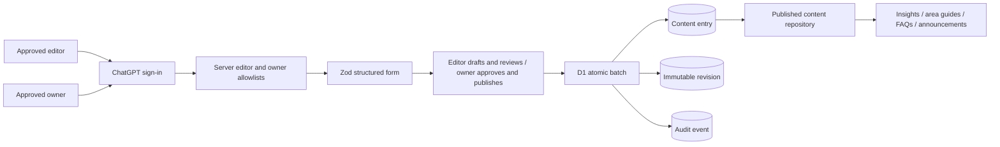
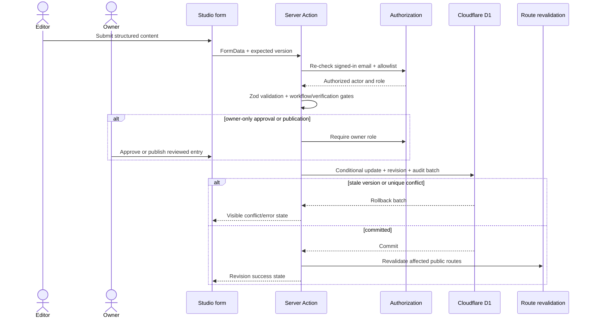

# Abdullah Properties Content Studio

Status: implemented editorial CMS foundation
Runtime: Next.js App Router on vinext/Cloudflare Worker
Persistence: Cloudflare D1 through logical binding `DB`

## Scope and boundary

The Content Studio manages low-risk structured editorial entries: insights, area guides, FAQs, and announcements. Company identity, leadership, legal documents, project ownership, approvals, specifications, pricing, availability, and performance claims remain code-reviewed/owner-approved data outside generic publishing.

The public site keeps a curated source fallback. A missing database or unapplied migration never turns browser storage into an authoritative content store and never removes the verified public baseline.

## Flow

## Mutation sequence

## Database design

- `content_entries`: current structured version, type/slug identity, workflow, verification, SEO, featured flag, timestamps, and optimistic `version`.
- `content_revisions`: immutable JSON snapshot for every committed version, unique on `(entry_id, version)`.
- `audit_events`: actor, action, entity, metadata, and timestamp.
- Unique `(type, slug)` protects stable public addresses.
- Publication and featured indexes support public reads without table scans as the collection grows.

Migration source: `drizzle/0000_many_living_tribunal.sql`. Each prepared D1 statement contains one SQL statement; multi-record mutations use `batch`.

## Authorization and security

- Authentication is dispatch-owned ChatGPT sign-in.
- Authorization is split across case-insensitive server allowlists: `CMS_ALLOWED_EMAILS` grants editor access and `CMS_OWNER_EMAILS` grants owner access.
- An address in either list may access the studio. Owner membership takes precedence if an address appears in both lists. Missing or empty lists fail closed.
- Pages, previews, and mutations all repeat server-side authorization.
- Studio responses are `private, no-store` and carry `X-Robots-Tag: noindex, nofollow, noarchive`.
- CMS routes are excluded in `robots.txt` and omitted from the sitemap.
- Content accepts validated structured text blocks only; no raw HTML or `dangerouslySetInnerHTML` path exists.
- Editors can create drafts, move non-published entries through review, and archive non-published work. They cannot set `owner_approved`, publish, or alter published entries.
- Owners alone can record owner approval and publish. New entries still cannot publish directly; they must first be committed as a draft or review revision. FAQ and announcement publication requires explicit owner approval.
- Approval and publication provenance is recorded in immutable revisions and audit events with the actor email, timestamp, old/new status, and old/new verification state.
- Optimistic version checks plus unique revision constraints prevent silent last-write-wins overwrites.

## Operating states

- Loading: protected studio skeleton.
- Empty: explicit curated import and new-draft actions.
- Validation error: visible form alert; no partial write.
- Authorization error: signed-in-but-unapproved access state.
- Storage error: D1 unavailable state; no browser persistence fallback.
- Success: saved revision number and link to the managed entry.
- Runtime error: protected error boundary with safe retry.

## Deployment checklist

1. Keep `.openai/hosting.json` configured with `"d1": "DB"`.
2. Generate and inspect migrations after every schema change.
3. Set editor addresses in `CMS_ALLOWED_EMAILS` and publisher addresses in `CMS_OWNER_EMAILS` through hosted runtime environment management; never commit real allowlists.
4. Deploy the exact pushed commit and packaged migration.
5. Verify anonymous `/studio` redirects to sign-in.
6. Verify an unapproved signed-in account is denied and an editor cannot approve, publish, or mutate a published entry.
7. Verify an owner can import curated content, approve reviewed content, publish it, and see both old and new public routes revalidated after a type or slug change.
8. Verify two consecutive saves from the same open form advance the hidden optimistic version instead of reporting a false conflict.
9. Review audit/revision growth and add retention/export policy before high-volume editing.

## Trade-offs and next phase

D1 is the smallest durable platform-native system for the current editorial volume and deployment model. It avoids an external database and credential path while retaining indexes, atomic batches, and migration history. PostgreSQL/Prisma becomes preferable when property operations, enquiries, staff roles, complex reporting, or cross-service workloads exceed this bounded content domain. R2 media uploads remain intentionally deferred until ownership/license metadata, MIME inspection, randomized keys, size limits, and moderation are implemented together.
