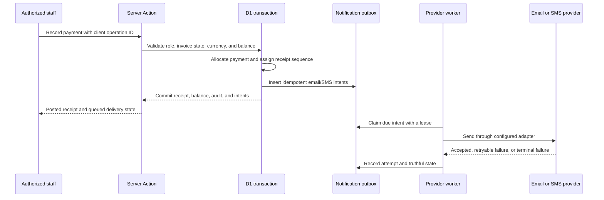

# Office documents and notification delivery

## Shipped boundary

- D1 remains authoritative for invoice, receipt, notice, sequence, tracking, and audit records.
- An invoice or notice receives an official number only during its guarded server-side issue transition.
- A payment receives its receipt number, allocation, balance update, tracking code, audit events, and notification outbox intents in one D1 batch.
- Public tracking is deliberately no-index and returns only document type, controlled number, date, state, and a masked recipient name. It never returns contact details or financial values.
- Print/PDF output uses one colored A4 document system with the transparent brand lockup, a real logo-mark watermark, immutable party snapshots, and a QR verification link.
- Browser “Save as PDF”, email, and SMS controls are honest manual handoffs. They do not claim a file was saved, attached, sent, or delivered.

## Delivery flow

## Provider rule

The repository currently ships disabled email and SMS transports. This is intentional: no provider or credentials have been approved. A queued record must never be marked sent until a verified provider adapter confirms acceptance. Provider secrets belong only in the server runtime; they must never enter the browser, generated PDF, QR URL, or future desktop renderer.

Before enabling automatic dispatch:

1. Select and contract approved email and Bangladesh SMS providers.
2. Implement adapters against the providers' published APIs without changing the domain transport interface.
3. Add secret bindings through the deployment platform; do not commit secret names or values until the adapter contract exists.
4. Implement signed webhook validation and map provider delivery updates to separate acceptance and delivery states.
5. Run duplicate retry, timeout-after-acceptance, rate-limit, revoked-recipient, and dead-letter tests.

## Deployment gate

Apply `drizzle/0002_needy_spectrum.sql` before exposing the new Office routes. The migration is additive and creates notices, revisions, contact notification preferences, outbox records, attempts, tracking fields, and client-operation idempotency. A deployment is not ready if the migration test, Office artifact tests, production build, or authenticated print-route checks fail.

## Native/offline rule

Offline clients may print a clearly marked draft invoice or provisional payment acknowledgement. They must not allocate an official sequence or claim server acceptance. On reconnect, the server validates the idempotent command and returns the official immutable snapshot; only that snapshot can activate public tracking and enqueue notifications.
