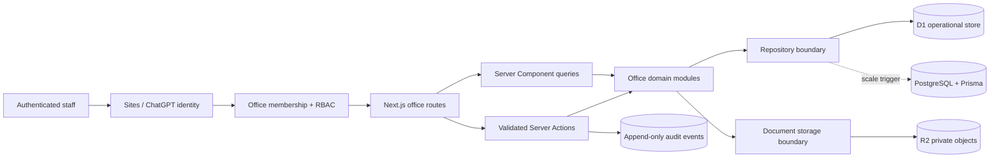

# Abdullah Properties Office Management Architecture

Status: accepted for the first operational release  
Market assumption: one Joypurhat office, Bangladesh  
Delivery style: protected modular monolith with explicit PostgreSQL extraction seams

## 1. Executive summary

The office product is a separate authenticated surface inside the Abdullah Properties platform. It is not an extension of the editorial CMS. It coordinates customer and landowner relationships, property and project work, staff tasks, controlled documents, invoicing, collections, expenses, approvals, and management reporting.

The first release uses the existing Cloudflare D1 and Sites identity boundary so it can ship with the deployed platform. Every operational module owns typed repository functions so PostgreSQL and Prisma can replace D1 without rewriting route composition or workflows. D1 is a bounded single-office decision, not the long-term financial-system promise.

## 2. Product problems

- Enquiries, follow-ups, site visits, documents, and financial commitments are easy to fragment across calls, chat, paper, and spreadsheets.
- Landowner joint ventures require a visible evidence trail across ownership records, feasibility, negotiation, agreements, obligations, and handover.
- Project work needs one current view of milestones, risks, decisions, tasks, costs, and document revisions.
- Invoice, receipt, payment, and expense records require immutable posting, approval, allocation, and audit controls.
- Staff access must be limited by role; authentication alone must never grant office membership.
- Uploaded evidence is a record for professional review, not automatic proof of title, approval, tax treatment, or compliance.

## 3. Experience model

The workspace prioritizes the next decision instead of generic dashboard decoration:

1. **Today** — overdue follow-ups, tasks, collections, approvals, and project risks.
2. **Relationships** — leads, customers, landowners, communication history, and next actions.
3. **Delivery** — land pipeline, projects, milestones, units, documents, and decisions.
4. **Money** — quotations, invoices, receipts, payments, expenses, and receivables.
5. **Control** — team roles, approvals, audit, settings, retention, and exports.

Every list includes an empty state, URL-backed filters, status vocabulary, and a primary action. Every mutation returns a visible success or error state. Destructive financial rewrites are not offered.

## 4. System design



Public pages never query unrestricted office tables. Future public inventory uses a separate verified publication projection with explicit owner approval.

## 5. Bounded contexts

- `identity`: membership, role, permission, status, bootstrap owner.
- `crm`: contacts, leads, activities, assignments, site visits, next actions.
- `land`: parcels, owners, mouza/JL/dag/khatian metadata, due-diligence state, JV stage.
- `projects`: project records, milestones, tasks, risks, decisions, and progress.
- `finance`: quotations, invoices, line snapshots, payments, receipts, expenses, approvals, and document sequences.
- `documents`: object metadata, entity links, classification, revision, visibility, and review status.
- `reporting`: read-only aggregates for pipeline, receivables, delivery, workload, and control exceptions.
- `audit`: actor-attributed immutable business events.
- `cms`: the existing editorial system; intentionally separate.

## 6. Roles and permissions

Initial roles are `owner`, `admin`, `manager`, `sales`, `projects`, `accounts`, and `viewer`. Permissions are fixed, code-reviewed capabilities such as `crm.read`, `crm.write`, `finance.post`, `expenses.approve`, `documents.read`, `team.manage`, and `audit.read`.

Authentication identifies the user. Authorization then checks an active office membership or the configured bootstrap owner. Every page query, Server Action, and file route repeats the server-side permission check. The layout is never the only security boundary.

Segregation rules:

- No staff member approves their own expense.
- Sales staff cannot post invoices or payments.
- Accounts staff can prepare finance records; posting and exceptional adjustments require elevated permission.
- Posted invoices are immutable. Corrections use linked adjustment documents in a later accounting-controlled phase.
- System administrators cannot silently rewrite financial history.

## 7. Core workflows

### CRM

```text
New lead -> Qualified -> Site visit -> Proposal -> Negotiation -> Won/Lost
```

Every stage change records the actor, timestamp, note, assignment, and next action.

### Landowner / joint venture

```text
Land lead -> Document intake -> Due diligence -> Survey/feasibility
-> Commercial proposal -> Negotiation -> Legal/owner approval
-> MoU/JV agreement -> Project gates -> Obligations -> Handover/closeout
```

Land records capture available mouza, JL, dag, khatian, share, area, mutation, land-tax, boundary, possession, and review metadata. A status label communicates review state without representing legal title certification.

### Project delivery

```text
Feasibility -> Secured -> Design -> Approval gate -> Delivery
-> Inspection -> Handover -> Defect follow-up -> Closeout
```

Milestones, decisions, risks, tasks, and document revisions remain linked to the project timeline.

### Finance

```text
Draft -> Validate -> Approve -> Allocate fiscal sequence -> Post
-> Part paid / Paid / Overdue
```

The first release creates commercial invoices and receipts. VAT-specific output is enabled only after Abdullah Properties supplies approved legal entity, place-of-supply, BIN, tax configuration, and accountant sign-off.

### Expenses

```text
Draft -> Submit -> Manager review -> Approve/Reject -> Pay/Settle
```

The actor who submitted the expense cannot approve it. Receipt evidence and reason are retained with the audit event.

## 8. Database design

All identifiers are UUIDs. Money is stored as integer minor units for the D1 release; the PostgreSQL adapter uses `NUMERIC(18,2)`. Timestamps are UTC ISO strings and displayed in `Asia/Dhaka`. Frequently edited records have optimistic `version` columns. Archive states replace silent deletion.

Core tables:

- `office_members`
- `office_contacts`
- `office_leads`
- `office_activities`
- `office_land_parcels`
- `office_projects`
- `office_milestones`
- `office_tasks`
- `office_invoices`
- `office_invoice_items`
- `office_payments`
- `office_payment_allocations`
- `office_expenses`
- `office_approvals`
- `office_documents`
- `office_sequences`
- `office_audit_events`

Important indexes cover normalized email, lead stage/assignee/next action, contact search, land stage, project status, overdue task lookup, invoice status/due date, payment date, expense status, approval assignee/status, document entity, and audit entity/time.

## 9. Invoice engineering

Invoice numbers use an atomic branch/year/document sequence. A posted record stores a complete customer, address, line, currency, totals, tax configuration, company identity, and terms snapshot so later profile edits do not change history.

Controls:

- All totals are recomputed on the server.
- Client-provided totals are ignored.
- Line quantity and unit price use bounded decimal validation.
- Sequence uniqueness is database-enforced.
- Payment allocations cannot exceed the outstanding balance.
- Print output is generated from the immutable snapshot and can be saved as PDF through the browser print boundary.
- NBR VAT-6.3 fields remain unavailable until verified tax configuration exists. A commercial invoice must not be represented as a compliant tax invoice automatically.

## 10. API and action design

- Server Components call query functions directly.
- Same-origin form mutations use validated Server Actions.
- File download uses an authenticated Route Handler with attachment-only response headers.
- Future external integrations use versioned REST endpoints, idempotency keys, and explicit contracts.
- Every mutation returns typed field/global errors and writes an audit event in the same D1 batch when possible.

## 11. Document storage

R2 stores private object bytes; D1 stores ownership, object key, original filename, MIME, size, checksum, classification, review state, entity link, actor, and timestamps. Initial uploads are limited to approved PDF/image types and conservative size limits. Downloads are permission-checked and served as private attachments with `nosniff` and a sandboxed CSP.

Malware scanning, OCR, public sharing, and external document signatures are deferred until a supported provider and legal workflow are approved. OCR may suggest metadata but never approves title or compliance evidence.

## 12. Security

- SIWC authentication plus D1 membership authorization.
- Least-privilege RBAC; later branch/project ABAC when multiple scopes exist.
- Server-side Zod validation for every external input.
- No raw HTML in operational notes.
- Private/no-store/noindex headers for `/office/*`.
- Field masking for future NID, TIN, BIN, bank, and KYC data.
- Append-only audit history with actor and metadata.
- Size/MIME validation and attachment-only downloads.
- CSP, frame protection, secure referrer policy, and no public indexing.
- Retention, subject requests, backups, incident response, and quarterly access review must be approved operational policies before sensitive KYC rollout.

## 13. Performance and state

Office reads are Server Components with parallel queries and bounded result sets. Filters and search live in the URL. Client state is limited to forms, mobile navigation, and invoice line editing. Public bundles do not include office UI code. D1 aggregates are indexed and measured before caching is introduced.

Redis is intentionally deferred. It becomes justified for distributed rate limits, durable job coordination, short-lived holds, idempotency, and expensive shared reports. Pub/Sub is not a business-event queue.

## 14. Failure states

- Missing D1 migration: show an explicit setup state; never pretend that records were saved.
- Unauthorized user: show a denial state without business data.
- Optimistic conflict: reject the mutation and require reload.
- Missing R2 binding/object: preserve metadata and surface a recoverable document error.
- Duplicate sequence or payment retry: reject through unique/idempotency controls.
- Report query failure: isolate the card/section where possible and log a request-safe error.

## 15. Testing strategy

- Unit: permission matrix, workflow transitions, monetary arithmetic, invoice numbering, parsing, and sanitization.
- Repository integration: migrations, prepared queries, optimistic updates, aggregate correctness, and audit atomicity.
- Route/render: noindex/private headers, anonymous redirects, unauthorized denial, and empty states.
- E2E: owner access, lead creation, task creation, invoice creation/print, payment allocation, expense approval denial, mobile navigation, and keyboard path.
- Security: MIME/size rejection, cross-role action denial, output encoding, duplicate posting, and inaccessible private documents.
- Non-functional: accessibility, 320px overflow, bundle budgets, and audit completeness.

## 16. Deployment and migration

Migrations are additive. Existing CMS migration `0000` remains unchanged. Office tables ship in a new generated migration. The code detects missing tables and fails visibly. Before production activation, back up D1, apply the migration, configure the owner bootstrap, verify empty-state access, then perform one owner-controlled test record and cleanup through an auditable archive action.

R2 is enabled only with the document module. The deployed application retains no secret or staff identity in source control.

## 17. Scale triggers and future roadmap

Move the operational adapters to PostgreSQL/Prisma when any of these become real:

- multiple branches or legal entities;
- public/customer/vendor portals with sustained concurrent writes;
- unit booking holds requiring strong transactional constraints;
- full procurement, BOQ, three-way matching, or accounting subledgers;
- external BI and high-volume reporting;
- bank reconciliation, payment providers, or durable background workflows.

Later phases add KYC/CDD, unit inventory and bookings, installment schedules, credit/debit adjustments, procurement, vendor bills, project budgets, field inspections, customer/landowner portals, notification providers, and accountant-controlled exports. A general ledger is not built until an accountant approves the chart, fiscal rules, opening balances, and reconciliation policy.

## 18. Sources informing the workflow

- Bangladesh Real Estate Development and Management Act: project approval/publication controls.
- Ministry of Land mutation services: land-record and mutation workflow fields.
- NBR VAT Rules and VAT guidance: invoice fields, fiscal sequences, digital records, and retention.
- Joypurhat citizen services: local approval evidence/checklist direction.
- BFIU DNFBP guidance: real-estate CDD, monitoring, restricted reporting, and retention.
- RICS project-management guidance, Procore document-management practices, and Odoo expense/invoice workflows: stage gates, document control, permissions, and maker-checker patterns.

These sources shape configurable workflows. They do not replace professional legal, tax, engineering, or title review.
