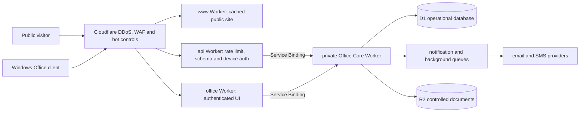

# Abdullah Properties production edge architecture

Status: architecture decision record for the first stable desktop/Office release.

## Decision

Do not move the whole application to a traditional standalone server merely to obtain a second hostname. A second hostname backed by the same Worker and failure domain does not isolate an outage. Before broad public desktop distribution, split the internet-facing workloads into independently deployed Cloudflare Workers while keeping a private, typed service boundary around the authoritative Office domain.

Cloudflare recommends Custom Domains for independently addressable Workers and supports Worker-to-Worker composition. DDoS protection is always on, while WAF, rate limiting, bot controls and API Shield add application-specific controls. The relevant primary documentation is:

- <https://developers.cloudflare.com/workers/configuration/routing/custom-domains/>
- <https://developers.cloudflare.com/ddos-protection/about/>
- <https://developers.cloudflare.com/waf/>
- <https://developers.cloudflare.com/workers/runtime-apis/bindings/rate-limit/>

## Release topology

| Surface | Proposed hostname | Responsibility | Database access |
| --- | --- | --- | --- |
| Public website | `www.abdullahproperties.com.bd` | Marketing, property/service content, SEO, public tracking hand-off | None by default; aggressively cached read model only |
| Office portal | `office.abdullahproperties.com.bd` | Authenticated server-rendered Office UI | Private service binding to Office Core |
| Desktop API | `api.abdullahproperties.com.bd` | Pairing, sync, future update metadata | Private service binding to Office Core |
| Office Core | no public route | Domain rules, transactions, audit, idempotency, notification outbox | D1/R2/Queue bindings |

The current `chatgpt.site` deployment remains a controlled engineering origin. The desktop release pins that exact origin until the approved custom API hostname and certificate are active; changing it requires a signed application update.

## DDoS and abuse controls

1. Cloudflare edge terminates TLS and absorbs network/application DDoS traffic before a Worker runs.
2. A custom WAF rule challenges or blocks anomalous `/api/office/*` traffic before D1 access.
3. Cloudflare Rate Limiting keys authenticated traffic by device/API identity and unauthenticated pairing traffic by edge network identity. IP-only limits are not used for legitimate authenticated staff because shared office/mobile networks create false positives.
4. The application applies a second pre-auth minute window before credential lookup and a stricter per-device window after authentication.
5. Request and response bodies are streamed with hard byte limits; redirects are disabled; the Windows release pins the approved HTTPS origin.
6. Device pairing uses a ten-minute one-use code. The browser never receives the 30-day bearer; the native app stores it under current-user DPAPI.
7. D1 idempotency, optimistic versions and immutable audit events prevent retries from duplicating business operations.

## Failure isolation

- A public-site traffic spike cannot consume the API Worker concurrency budget.
- API deployment rollback does not roll back public SEO pages.
- The public site remains cacheable during Office maintenance.
- The Office Core Worker has no public hostname; only deployed UI/API Workers can invoke it.
- Notification provider failures remain in the outbox/queue and do not block invoice or payroll transactions.
- D1 remains a shared authoritative dependency initially. A later regional/read-model split must use an outbox/CDC projection; dual writes are prohibited.

## Observability and incident flow

- Every request gets a generated/propagated request ID; sensitive headers and payloads are redacted.
- Metrics: request count, status, latency, D1 duration, rate-limit decisions, pairing failures, sync conflicts, outbox age, payroll state transitions.
- Alerts are based on error-budget burn, not a single failed request.
- GitHub Actions verification failure opens or updates one deduplicated incident issue; a successful recovery run closes it. The workflow never checks out untrusted code and holds only `issues: write` permission.
- Production runtime incidents should ultimately create alerts in Sentry/observability tooling first; GitHub Issues is the engineering work queue, not the sole paging channel.

## Stable release gates

The first stable channel remains blocked until all of the following are true:

- EULA and governing law are approved by an authorised legal/business owner.
- NSIS/MSI and application binaries are Authenticode-signed with timestamp verification.
- Local PII encryption or an enforceable managed-device BitLocker/EFS policy is approved and tested.
- Custom API hostname, WAF, pre-auth/post-auth rate limits and incident alerts are active.
- Clean install, upgrade, rollback, offline recovery, v1 data recovery, pairing, revocation, retry and two-copy invoice print tests pass on supported Windows versions.
- Backup, restore, retention, credential rotation and staff offboarding runbooks are rehearsed.
